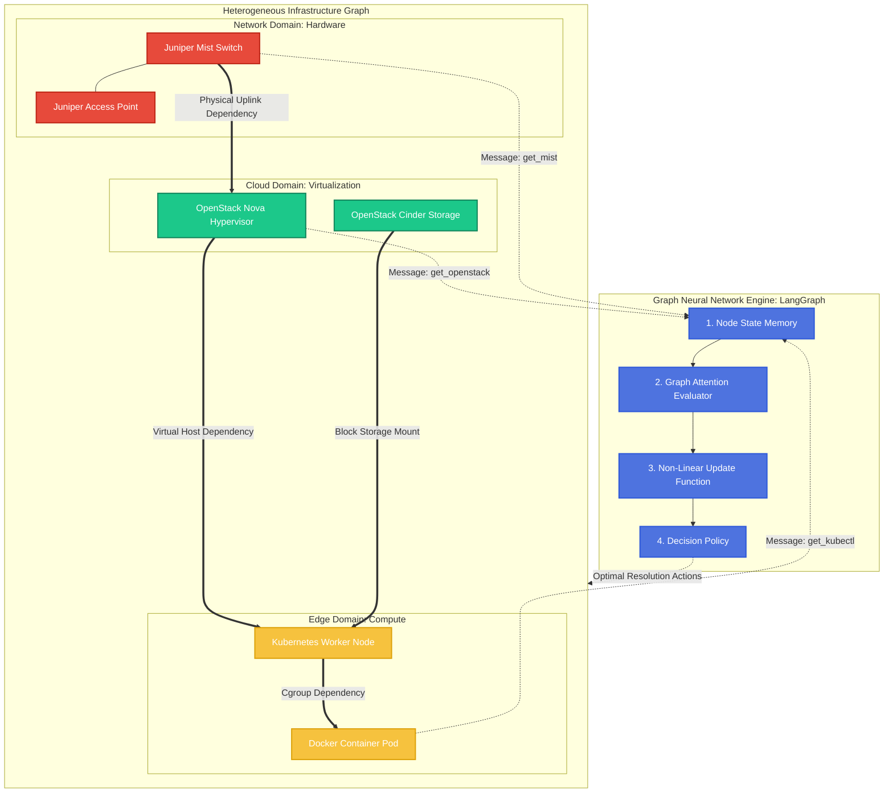

# AI SRE System: Architectural & Mathematical Defense Guide

This document aggregates the comprehensive Q&A and theoretical mappings used to explain the mathematical underpinnings of our Autonomous SRE Agent. Use this to bridge the practical Python implementation with deep learning theory (specifically Graph Neural Networks) for academic or architectural review.

---

## Part 1: LangGraph and the Reasoning Architecture

### Q: How is LangGraph utilized in this system opposed to a standard LLM?
Standard LLMs use a Directed Acyclic Graph (DAG) approach: you ask a question, it outputs an answer in a straight line, and it stops. 

Our architecture leverages **LangGraph**, which introduces **Cyclic Execution** and **State Memory**:
1. **State Initialization:** When a system alert triggers, a "State Memory" block is generated.
2. **LLM Node (The Brain):** The AI reads the state and decides it needs more context (e.g., K8s pod logs).
3. **Tool Node (The Hands):** The graph pauses the LLM and transitions to the relevant tool (e.g., executing `kubectl`). 
4. **The Cyclic Return:** The tool's output is appended to the State Memory, and the execution loops back to the LLM node. It continues cyclically hopping between Thinking and Acting until a root cause is resolved, cleanly simulating GNN state-updates.

---

## Part 2: Data Ingestion and Processing

### Q: Is the system Reactive or Proactive?
The system utilizes a **Hybrid Ingestion Pipeline**:
*   **Reactive (Push):** Hard crashes (like a Node dropping off) are "Pushed" instantly from Prometheus Alertmanager via webhooks.
*   **Proactive (Pull):** Background sleeper threads (`mist_alarm_poller` and `k8s_alert_poller`) passively run "Pull" queries against APIs every 60 seconds to detect silent degradation before hard failure.

### Q: Are all logs concatenated continuously into the AI?
**No.** Continuously feeding all logs into an LLM would cause immediate token-limit exhaustion and hallucinations. We use a **Trigger + Fetch on Demand** pattern.
1. The AI receives a tiny alert payload ("The Smoke Alarm").
2. The agent uses its LangGraph tools to dynamically query and pull only the precise slice of JSON metrics it requires for that specific incident. 

### Q: What data structures are used, and how does the AI process them?
Data traverses the network as standard **JSON REST payloads**. Instead of statically programming `if/else` statements to parse these keys, the Fast-API endpoint maps the JSON into a **Stringified Context Block**. The LangChain LLM processes this context organically via Natural Language Processing (NLP), understanding semantic correlations automatically.

### Q: How does the system decide what actually becomes an alert?
The SRE AI Agent is the **Incident Commander**, not the smoke detector. The specialized monitoring tools are responsible for generating the initial triggers:
1. **Cloud/Edge:** The `kube-prometheus-stack` utilizes industry-standard, strict PromQL mathematical rules (e.g., `kube_pod_status_ready == 0 FOR 5m`).
2. **Network (Juniper Mist):** Mist utilizes internal Machine Learning engines to construct baseline behaviors. If latency deviates from the historical norm, Mist's ML algorithm generates the dynamic anomaly trigger.

---

## Part 3: The GNN Theoretical Defense

### Q: How is a "Graph Neural Network" relevant to this setup?
GNNs are fundamentally designed to process data where relationships and spatial structures matter. 
1. **Heterogeneous Topology:** Our environment (Juniper Switch → OpenStack Hypervisor → Kubernetes Pod) is a literal Heterogeneous Directed Graph.
2. **Message Passing:** When the AI fetches logs from OpenStack to diagnose a K8s issue, it is executing GNN "Message Passing"—gathering states from neighbor nodes.
3. **Root Cause Isolation:** When the LLM decides to investigate a network alarm over a software alarm, it mathematically mirrors **Graph Attention Networks (GAT)**, dynamically shifting probabilistic weight to the faulty nodes.

### The Math to System Dictionary & Analogy
| Mathematical Concept | Practical Implementation in Our System |
| :--- | :--- |
| **Nodes (Vertices)** | Tangible infrastructure units (Juniper AP, OpenStack VM, K8s Pod). |
| **Node Features** | The live JSON metrics (CPU limits, SLE latency scores). |
| **Edges (Links)** | The physical/software dependency lines between the distinct layers. |
| **Message Passing** | The Python Tool calls querying adjacent infrastructure layer logs. |
| **Graph Attention (GAT)** | The LLM actively deciding the network logs are more important than the K8s logs. |
| **Update Function** | The agent rewriting its State Memory and concluding the root cause. |

> **The Spider Analogy:** 
> Imagine the data center is a massive web (The Graph). Every server/switch is a trapped fly (The Nodes), and cables are the silk (The Edges). When a fly vibrates (A Prometheus Alert), the AI acts as the spider. It traverses the silk strings (Message Passing via API tools) to examine adjacent flies. By evaluating which thread vibrates hardest (Graph Attention), it logically deduces the starting point of the anomaly.

---

## Part 4: Simplified Architectural Formulas

### A. Graph Topology (The Environment)
`G = (V, E)`
*Representing the entire virtual and physical network (V) and how they depend on each other (E).*

### B. Message Passing (AI Context Gathering)
`h_i(t+1) = Update( h_i(t) , Aggregate( messages_from_neighbors ) )`
*Our AI tools (Aggregate) pooling logs from neighboring servers, and the LLM (Update) forming a fresh conclusion `h_i(t+1)` based on that new data.*

### C. Graph Attention Weighting (Root Cause Focus)
`α_ij = Softmax( LLM_Priority_Score( Node_i , Neighbor_j ) )`
*The LLM prioritizing (assigning high `α` weight to) the Mist layer because it recognizes network packet drops are the root cause cascading up to the Pod.*

---

## Part 5: The Architectural Visualization

