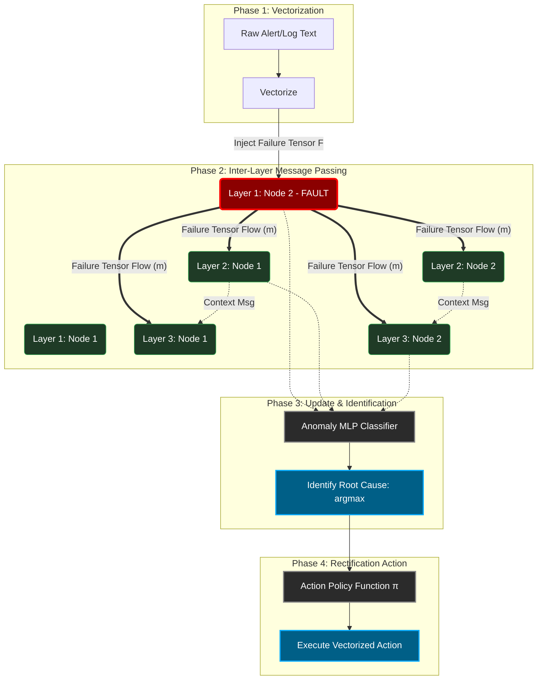

# Mathematical Representation of the Multi-Layer Infrastructure as a Graph Neural Network (GNN)

This document provides the formal mathematical framework for presenting your multi-tier autonomous system (Network, Cloud, Edge) as a continuous Graph Neural Network. It illustrates how system states are vectorized, how failure tensors propagate across fully-connected layers, and how the GNN identifies and rectifies faults during weight updates.

---

## 1. System Topology Definition (The Graph $\mathcal{G}$)

Let the entire infrastructure be modeled as a Heterogeneous Directed Graph, **$\mathcal{G} = (\mathcal{V}, \mathcal{E})$**.

### 1.1 Layered Node Sets
The vertex set $\mathcal{V}$ is partitioned into $K$ fully-connected operational layers (e.g., $K=3$ for Network, OpenStack, Kubernetes):
$$ \mathcal{V} = L_1 \cup L_2 \cup \dots \cup L_K $$
Where each layer $L_k$ contains multiple nodes (e.g., switches, hypervisors, pods):
$$ L_k = \{v_1^{(k)}, v_2^{(k)}, \dots, v_{N_k}^{(k)}\} $$

### 1.2 Full Inter-Layer Connectivity (Edges)
To ensure any failure contexts are globally aware, the layers are interconnected. The edge set $\mathcal{E}$ contains connections between node $u \in L_i$ and node $v \in L_j$.
$$ \mathcal{E} = \{ (u, v) \mid u \in L_i, v \in L_j, \forall i, j \} $$
*In this dense topology, a tensor generated in Layer 1 can pass its influence matrix directly to Layer 3.*

---

## 2. Vectorization and Initial State (Time $t=0$)

When a system operates, every node generates text logs, metrics, and alerts. To process this, the data is **vectorized** into an initial embedding (tensor).

### 2.1 Node Feature Matrix
For each node $v$, its telemetry and text logs are embedded into a $d$-dimensional feature vector $\mathbf{x}_v$:
$$ \mathbf{h}_v^{(0)} = \text{Embed}(\text{Logs}_v, \text{Metrics}_v) \in \mathbb{R}^d $$

### 2.2 The Failure Tensor ($\mathbf{F}$)
If a node $f \in L_k$ experiences a failure (e.g., kernel panic, link down), its raw text error is converted into an anomaly tensor:
$$ \mathbf{F}_f = \text{Vectorize}(\text{Error\_String}) $$
This failure tensor is injected into the node's initial state:
$$ \mathbf{h}_f^{(0)} = \mathbf{h}_f^{(0)} \oplus \mathbf{F}_f $$

---

## 3. Tensor Flow & Failure Propagation (Message Passing)

The core of the GNN is the distribution of the failure tensor across all layers. Because the layers are fully connected, a fault in one node influences the context of the entire system.

### 3.1 Message Generation
At each step $t$, a message tensor $\mathbf{m}_{vu}^{(t)}$ flows from node $u$ to node $v$. It carries the failure context.
$$ \mathbf{m}_{vu}^{(t)} = \text{MSG}\left( \mathbf{h}_u^{(t-1)}, \mathbf{h}_v^{(t-1)}, \mathbf{e}_{uv} \right) $$
Where $\mathbf{W}_{msg}$ is a learnable weight matrix defining how much error context passes between layers.

### 3.2 Global Failure Aggregation
A node $v$ receives tensors from *all* adjacent layers. It aggregates them to understand the global system failure context:
$$ \mathbf{a}_v^{(t)} = \sum_{u \in \mathcal{N}(v)} \alpha_{vu} \mathbf{W} \mathbf{m}_{vu}^{(t)} $$
*Here, $\alpha_{vu}$ is the Attention Weight (using Graph Attention Networks - GAT), which dynamically assigns higher importance to failure-originating tensors.*

---

## 4. Weight Updates & Global Context Integration

The overall system uses the aggregated failure contexts to update the internal representation (weights) of every node simultaneously.

### 4.1 The Update Function
The new tensor state of node $v$ at step $t$ is calculated using a non-linear activation function (like ReLU) applied to its previous state and the aggregated failure messages:
$$ \mathbf{h}_v^{(t)} = \sigma \left( \mathbf{W}_{update} \cdot [ \mathbf{h}_v^{(t-1)} \parallel \mathbf{a}_v^{(t)} ] \right) $$
*(Because $\mathbf{a}_v^{(t)}$ contains failure contexts from all layers, the weight update mathematically forces node $v$ to "become aware" of failures outside its own layer).*

---

## 5. Identification of Fault & Rectification

After $T$ message-passing iterations, every node possesses a highly contextualized final embedding $\mathbf{h}_v^{(T)}$. The system now traces back the failure.

### 5.1 Root Cause Identification (Traceback)
The system calculates an Anomaly Score $\hat{y}_v$ for every node across all layers using a Multi-Layer Perceptron (MLP):
$$ \hat{y}_v = \text{MLP}(\mathbf{h}_v^{(T)}) $$
The true root cause is identified mathematically as the node with the maximum tensor divergence:
$$ \text{Fault\_Node} = \underset{v \in \mathcal{V}}{\mathrm{argmax}} (\hat{y}_v) $$

### 5.2 Rectification (Action Policy)
Once the fault tensor trace is resolved to a specific node, the final embedding of that node $\mathbf{h}_{\text{Fault}}^{(T)}$ is passed into an Action Policy function $\pi$, which generates the vector map for the remediation script (e.g., restart pod, reroute BGP):
$$ \text{Action\_Vector} = \pi \left( \mathbf{h}_{\text{Fault}}^{(T)} \right) $$

---

## 6. Flow Visualization

You can use the following visual mapping to explain the math in your presentation:

### Presentation Key Takeaways
1. **Vectorization**: Errors are not parsed as strings; they are mathematically mapped into $n$-dimensional space ($\mathbf{F}_f$).
2. **Contextual awareness**: By passing $\mathbf{m}_{vu}$ across all layers, OpenStack hypervisors mathematically "know" when a Kubernetes pod above it is failing.
3. **Traceability**: Because the weights update based on the aggregated attention $\alpha_{vu}$, the GNN naturally highlights the exact gradient path leading back to the original anomaly source.
