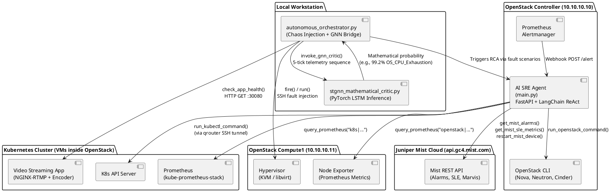
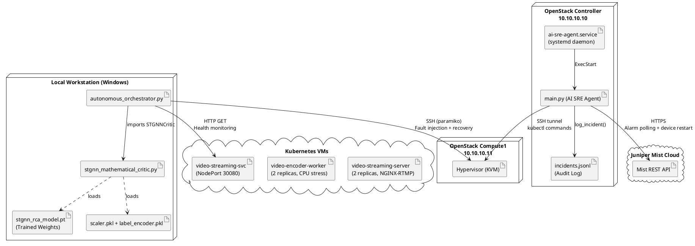
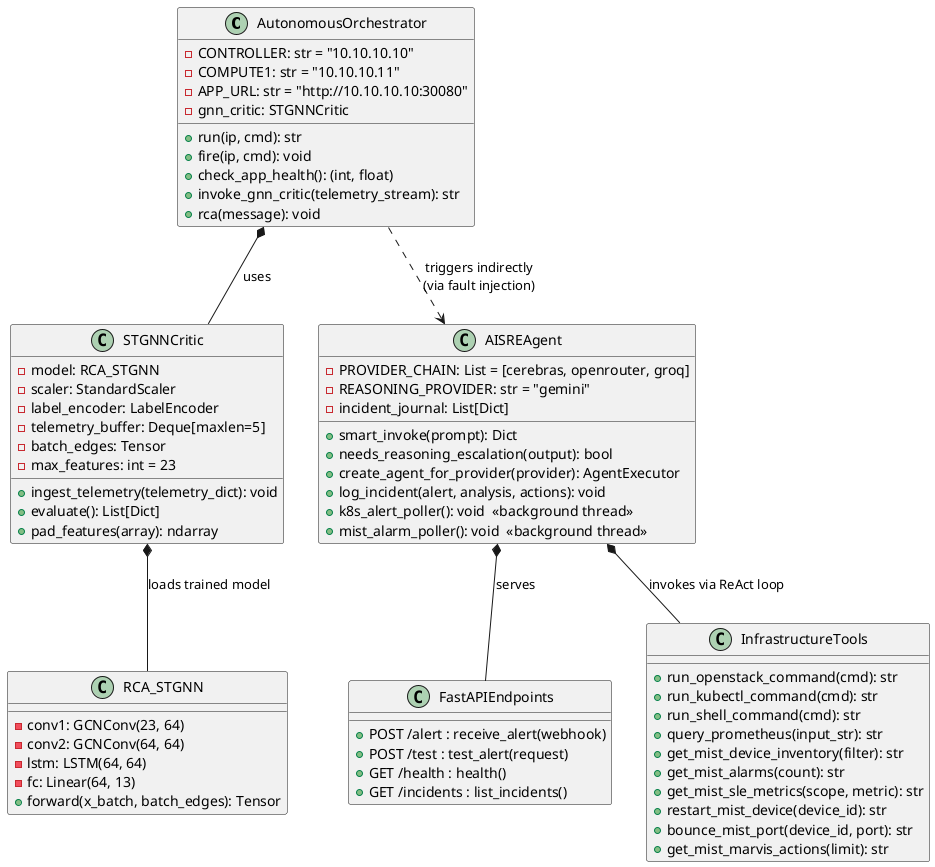
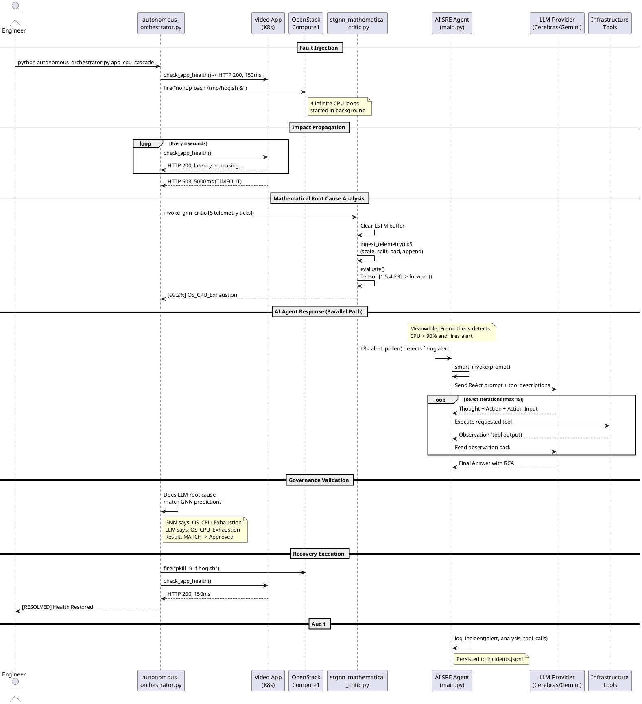
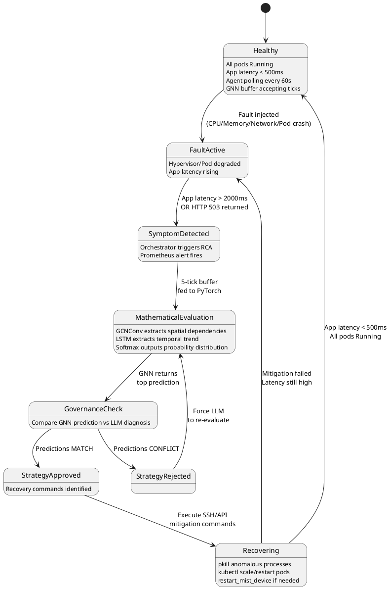
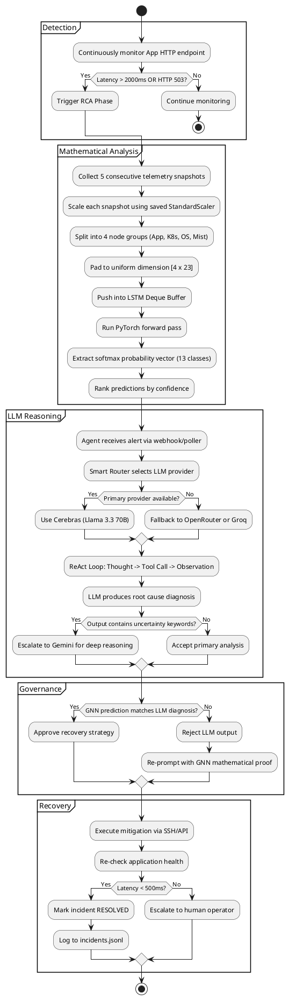

# Autonomous AI SRE System: Formal System Modeling

This document presents the formal system models for the **real-time operational system only**. All offline/one-time components (dataset generation, model training) are excluded — they are prerequisites, not part of the running system.

---

## 1. Component Diagram — What Exists at Runtime

---

## 2. Deployment Diagram — Where Each Module Runs

---

## 3. Class Diagram — Runtime Object Structure

---

## 4. Sequence Diagram — Full Fault Lifecycle

---

## 5. State Diagram — System Lifecycle States

---

## 6. Activity Diagram — Decision Logic Flow

